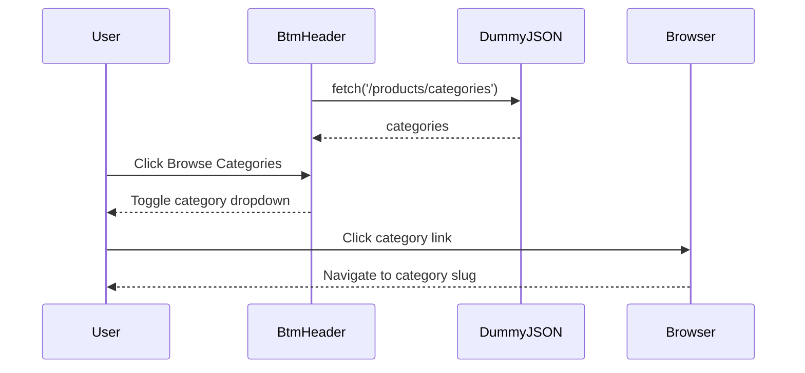

## Reviewer's Guide

The PR implements a styled bottom navigation header with pathname-based active states, a DummyJSON-backed category dropdown, and authentication links, while replacing the default README with project-specific documentation.

#### Sequence diagram for category loading and dropdown navigation

### File-Level Changes

| Change | Details | Files |
| ------ | ------- | ----- |
| Replaced the placeholder bottom header with client-side navigation and category browsing. | <ul><li>Added configured links for primary site sections.</li><li>Highlights the link matching the current pathname.</li><li>Adds login and registration icon links.</li><li>Fetches product categories from DummyJSON and renders them in a toggleable dropdown.</li><li>Uses category slugs as category link destinations.</li></ul> | `component/header/BtmHeader.tsx` |
| Added layout, interaction, and visual styles for the bottom header. | <ul><li>Styles the category trigger and animated dropdown list.</li><li>Adds responsive header navigation structure, active-link highlighting, and authentication icons.</li><li>Applies colors, spacing, typography, borders, and scrolling behavior to the new controls.</li></ul> | `component/header/header/header.module.css` |
| Expanded project documentation from the default Next.js README into project-specific documentation. | <ul><li>Documents features, technology stack, structure, setup, scripts, deployment, author information, status, and licensing.</li></ul> | `README.md` |

---

