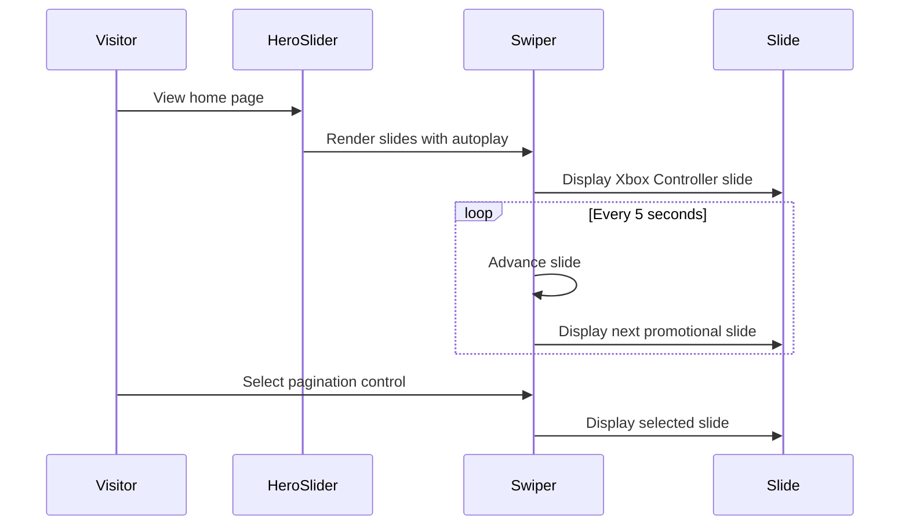

## Reviewer's Guide

Adds a Swiper-powered hero carousel with autoplay, looping, pagination, promotional product slides, and shared CTA styling, then integrates it into the home page beneath a refactored fixed Header component.

#### Sequence diagram for the autoplaying hero carousel

### File-Level Changes

| Change | Details | Files |
| ------ | ------- | ----- |
| Introduces a client-side Swiper carousel for featured-product hero promotions. | <ul><li>Adds three promotional slides with product copy, banner imagery, and Shop Now links.</li><li>Configures looping, five-second autoplay, and pagination using Swiper modules.</li><li>Adds responsive-oriented hero, slide content, image, and button styling.</li></ul> | `component/heroSlider/HeroSlider.tsx` `component/heroSlider/HeroSlider.css` `package.json` `package-lock.json` |
| Integrates the new hero section into the home page alongside a reusable fixed header. | <ul><li>Replaces direct header composition with the new Header wrapper.</li><li>Renders HeroSlider on the home page.</li><li>Updates header component imports after moving files into subdirectories.</li></ul> | `app/page.tsx` `component/header/header.tsx` `component/header/BtmHeader.tsx` `component/header/TopHeader.tsx` |
| Adds shared layout and CTA styles and adjusts page offset for the fixed header. | <ul><li>Adds a centered, width-constrained container utility.</li><li>Adds reusable rounded button styling with hover scaling.</li><li>Applies a fixed top padding and important background override to the body.</li></ul> | `app/globals.css` |

---
