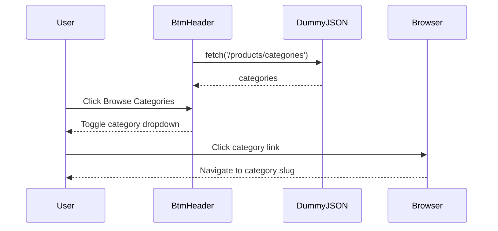

<!-- Generated by sourcery-ai[bot]: start review_guide -->

## Reviewer's Guide

The PR implements a styled bottom navigation header with pathname-based active states, a DummyJSON-backed category dropdown, and authentication links, while replacing the default README with project-specific documentation.

#### Sequence diagram for category loading and dropdown navigation

### File-Level Changes

| Change | Details | Files |
| ------ | ------- | ----- |
| Replaced the placeholder bottom header with client-side navigation and category browsing. | <ul><li>Added configured links for primary site sections.</li><li>Highlights the link matching the current pathname.</li><li>Adds login and registration icon links.</li><li>Fetches product categories from DummyJSON and renders them in a toggleable dropdown.</li><li>Uses category slugs as category link destinations.</li></ul> | `component/header/BtmHeader.tsx` |
| Added layout, interaction, and visual styles for the bottom header. | <ul><li>Styles the category trigger and animated dropdown list.</li><li>Adds responsive header navigation structure, active-link highlighting, and authentication icons.</li><li>Applies colors, spacing, typography, borders, and scrolling behavior to the new controls.</li></ul> | `component/header/header/header.module.css` |
| Expanded project documentation from the default Next.js README into project-specific documentation. | <ul><li>Documents features, technology stack, structure, setup, scripts, deployment, author information, status, and licensing.</li></ul> | `README.md` |

---

Tips and commands

#### Interacting with Sourcery

- **Trigger a new review:** Comment `@sourcery-ai review` on the pull request.
- **Continue discussions:** Reply directly to Sourcery's review comments.
- **Generate a GitHub issue from a review comment:** Ask Sourcery to create an
  issue from a review comment by replying to it. You can also reply to a
  review comment with `@sourcery-ai issue` to create an issue from it.
- **Generate a pull request title:** Write `@sourcery-ai` anywhere in the pull
  request title to generate a title at any time. You can also comment
  `@sourcery-ai title` on the pull request to (re-)generate the title at any time.
- **Generate a pull request summary:** Write `@sourcery-ai summary` anywhere in
  the pull request body to generate a PR summary at any time exactly where you
  want it. You can also comment `@sourcery-ai summary` on the pull request to
  (re-)generate the summary at any time.
- **Generate reviewer's guide:** Comment `@sourcery-ai guide` on the pull
  request to (re-)generate the reviewer's guide at any time.
- **Resolve all Sourcery comments:** Comment `@sourcery-ai resolve` on the
  pull request to resolve all Sourcery comments. Useful if you've already
  addressed all the comments and don't want to see them anymore.
- **Dismiss all Sourcery reviews:** Comment `@sourcery-ai dismiss` on the pull
  request to dismiss all existing Sourcery reviews. Especially useful if you
  want to start fresh with a new review - don't forget to comment
  `@sourcery-ai review` to trigger a new review!

#### Customizing Your Experience

Access your [dashboard](https://app.sourcery.ai) to:
- Enable or disable review features such as the Sourcery-generated pull request
  summary, the reviewer's guide, and others.
- Change the review language.
- Add, remove or edit custom review instructions.
- Adjust other review settings.

#### Getting Help

- [Contact our support team](mailto:support@sourcery.ai) for questions or feedback.
- Visit our [documentation](https://docs.sourcery.ai) for detailed guides and information.
- Keep in touch with the Sourcery team by following us on [X/Twitter](https://x.com/SourceryAI), [LinkedIn](https://www.linkedin.com/company/sourcery-ai/) or [GitHub](https://github.com/sourcery-ai).

<!-- Generated by sourcery-ai[bot]: end review_guide -->
